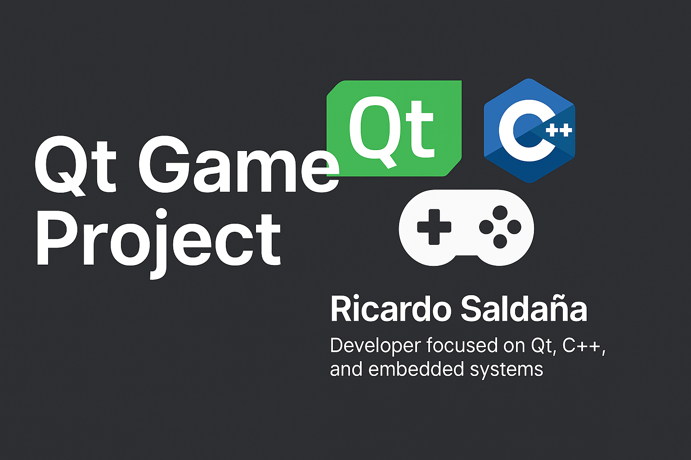

# Qt Game Project

This is a game built using **Qt**, combining **QML** for the user interface and **C++** for game logic. The project is structured to support modular development and cross-platform deployment, including WebAssembly.



## 🧰 Technologies Used

- Qt 6 (Quick, QML, Core)
- C++
- CMake
- MVC-inspired architecture

## 📁 Project Structure


## 🚀 Build Instructions

### Requirements

- Qt 6.x with QML and CMake support
- CMake ≥ 3.16
- Desktop or WebAssembly build kit

### Build for Desktop

```bash
mkdir build
cd build
cmake ..
cmake --build .
./appuntitled


> Developed by **Ricardo Saldaña** – passionate about C++, Qt, embedded systems and cross-platform development.
